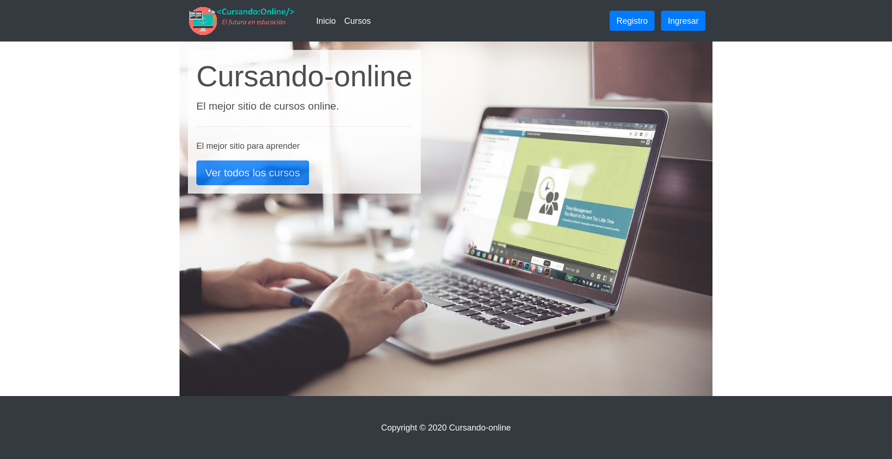

# Studying online

The project is a recreation of [TPE-WEB2 (php)](https://github.com/gabrielballone/TPE-WEB2) using the ASP.NET core.

The following technologies are used:
- [ASP.NET Core MVC](https://docs.microsoft.com/en-us/aspnet/core/tutorials/first-mvc-app/start-mvc?view=aspnetcore-6.0&tabs=visual-studio) as web user interface

- [Entity framework](https://docs.microsoft.com/en-us/ef/core/) for data layer management

## User accounts

For development purposes 2 user accounts are provided with the seed data:

- Email = "admin@admin.com", Password = "123",
- Email = "no-admin@admin.com", Password = "123",
